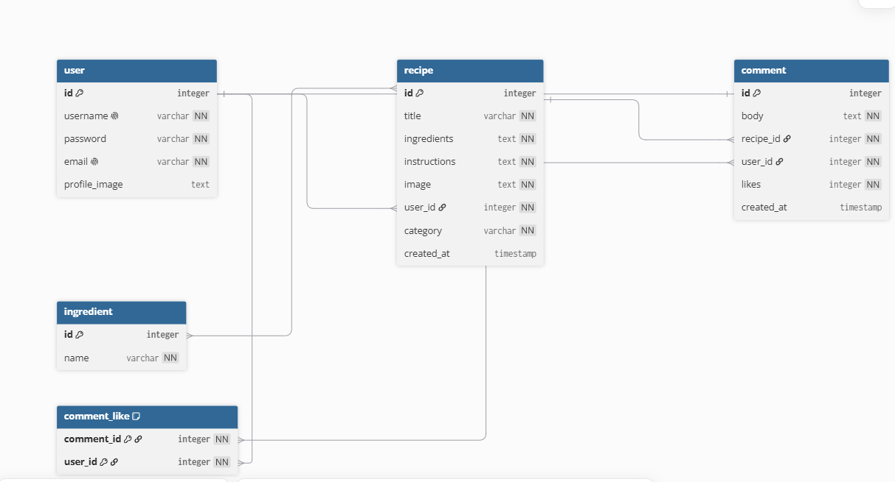

# Entity Relationship Diagram

Reference the Creating an Entity Relationship Diagram final project guide in the course portal for more information about how to complete this deliverable.

## Create the List of Tables

Table user{  
    id integer [primary key]  
    username varchar unique [not null]  
    password varchar [not null]  
    email varchar unique [not null]  
    profile_image text  
}

Table recipe{  
  id integer [primary key]  
  title varchar [not null]  
  ingredients text [not null]  
  instructions text [not null]
  image text [not null]  
  user_id integer [not null]  
  category varchar [not null]  
  created_at timestamp  
}

Table comment{  
  id integer [primary key]  
  body text [not null]  
  recipe_id integer [not null]  
  user_id integer [not null]  
  likes integer [not null]  
  created_at timestamp  
}

Table comment_like{  
  comment_id integer [primary key, not null]  
  user_id integer [primary key, not null]  
}

Table ingredient{  
  id integer [primary key]  
  name varchar [not null]  
}

//many to one  
Ref user_liked_comment: comment_like.user_id > user.id   

//many to one  
REF like_for_comment: comment_like.comment_id > comment.id  

//many to many  
Ref recipe_ingredient: recipe.id <> ingredient.id  

//many to one  
Ref user_recipe : recipe.user_id > user.id  

//many to one  
Ref user_comment: comment.user_id > user.id  

//many to one  
Ref recipe_comment: comment.recipe_id > recipe.id  

## Add the Entity Relationship Diagram

